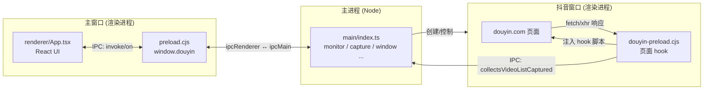
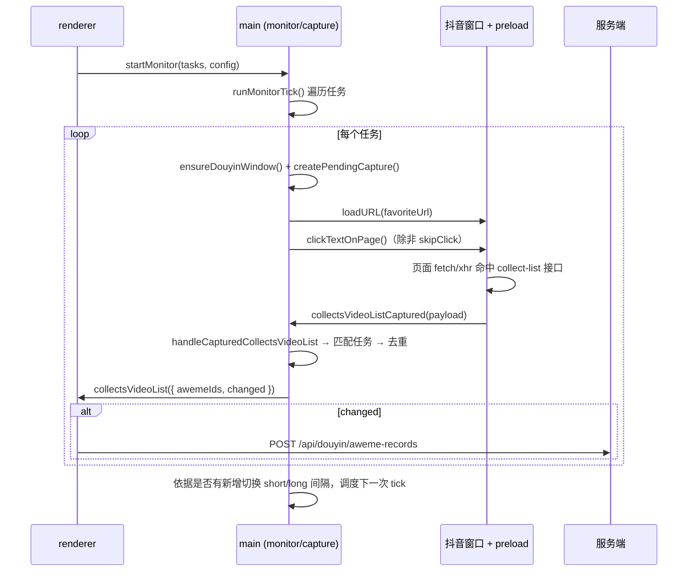

# DogeBot Desktop 架构与重构说明

> 本文档记录 `apps/desktop`（Electron 桌面客户端）的模块化重构方案与重构后的架构。
> 重构的核心原则是**行为完全不变**：仅调整代码组织方式，不改动任何运行时逻辑。

---

## 1. 背景

桌面端最初由两个巨型文件承载全部逻辑：

| 文件 | 行数 | 承载的职责 |
| --- | --- | --- |
| `src/main.ts` | ~1200 | app 生命周期、托盘、两个窗口、session 反检测、CDP debugger、250 行注入脚本、抓包处理、监听状态机、全部 IPC |
| `src/renderer.tsx` | ~1015 | 类型、localStorage 读写、API client、飞书机器人管理、抖音任务配置、事件订阅、全部 UI |

主要问题：

1. **单文件多职责**：主进程一个文件混了约 8 类关注点，渲染层是一个 1000 行的单组件（~20 个 `useState`、9 个几乎一样的持久化 `useEffect`）。
2. **跨进程重复**：类型（`DouyinTaskConfig` 等）、常量（默认 URL）、纯函数（`extractAwemeIds`、`isValidHttpUrl`）在 main / renderer / preload 多处各写一份；fetch/xhr 抓包 hook 脚本写了两遍。
3. **散落的魔法字符串**：9 个 IPC channel 名以字面量散布在 4 个文件里。
4. **可维护性差**：25 个模块级可变 `let` 全局变量与逻辑交织；渲染层从未接受类型检查（`tsc` 仅编译 `main.ts`）。

---

## 2. 重构方案

### 2.1 分层原则

按「进程边界」和「关注点」两个维度拆分，形成四个顶层目录：

```
src/
  shared/     ← main 与 renderer 共用的纯类型 / 常量 / 纯函数（无副作用、无框架依赖）
  main/       ← 主进程（Node/Electron 环境）
  preload/    ← 预加载脚本（contextBridge 桥接，CommonJS）
  renderer/   ← 渲染进程（浏览器/React 环境）
```

依赖方向严格单向：`main` 与 `renderer` 都可依赖 `shared`，但 `shared` 不依赖任何一方，`main` 与 `renderer` 互不依赖。

### 2.2 拆分粒度

- **主进程**：每个文件对应一个明确职责，控制在 100~200 行；抖音相关逻辑收进 `main/douyin/` 子目录。
- **渲染层**：`App.tsx` 退化为「编排根」——只持有状态、调用 hooks、组合组件；具体 UI 拆成展示型组件，副作用逻辑抽成 hooks。
- **状态收敛**：主进程 25 个全局 `let` 收敛为单个可变对象 `state`（见 [4.2](#42-主进程状态管理)）。

### 2.3 保持行为一致的约束

重构过程中严格遵守：

- 迁移后的每个函数体与原实现**逐字一致**（仅做 `state.` 前缀、常量替换等机械改写）。
- 注入到页面的脚本字符串保持不变。
- IPC channel 名、localStorage key、序列化方式保持不变。
- 恒为 `false` 的死分支（`douyinUseCdpPageHookCapture`）与未启用的 `fetch-debugger` 抓包模式**原样保留**，仅移动位置，不删除。

---

## 3. 目录结构

```
apps/desktop/
├── scripts/
│   └── copy-preload.mjs          # 构建后把 preload.cjs 复制到 dist 根目录
├── src/
│   ├── index.html                # 渲染层入口 HTML（引用 renderer/index.tsx）
│   ├── style.css
│   │
│   ├── shared/                   # ── 跨进程共享层 ──
│   │   ├── types.ts              #   DouyinTaskConfig / DouyinMonitorState / SharedConfig
│   │   ├── ipc-channels.ts       #   DouyinIpc：全部 IPC channel 名的单一来源
│   │   ├── constants.ts          #   默认 URL 常量
│   │   ├── aweme.ts              #   extractAwemeIds(s)：从响应提取 aweme_id
│   │   └── url.ts                #   isValidHttpUrl / normalizeCollectListBaseUrl
│   │
│   ├── main/                     # ── 主进程 ──
│   │   ├── index.ts              #   入口：app 生命周期装配（顺序敏感）
│   │   ├── log.ts                #   logDouyin
│   │   ├── paths.ts              #   preload / index.html 的运行时路径解析
│   │   ├── navigation.ts         #   URL 白名单、deeplink 拦截、DevTools 快捷键
│   │   ├── tray.ts               #   系统托盘
│   │   ├── main-window.ts        #   主窗口生命周期
│   │   └── douyin/               #   ── 抖音监听子域 ──
│   │       ├── types.ts          #     主进程私有类型（CaptureMode / PendingCapture 等）
│   │       ├── constants.ts      #     UA / partition / 等待时长 / 抓包模式开关
│   │       ├── state.ts          #     可变状态对象 + 生命周期集合
│   │       ├── session.ts        #     反检测 session（UA 覆写、请求头改写、协议拦截）
│   │       ├── injected-scripts.ts #   buildStealthScript：页面注入脚本构造器
│   │       ├── debugger.ts       #     CDP debugger 挂载 + 注入
│   │       ├── window.ts         #     抖音窗口生命周期 + 可见性 + 抓包配置同步
│   │       ├── tasks.ts          #     任务归一化、URL 匹配、工具函数
│   │       ├── capture.ts        #     抓包结果处理、去重、pending 等待
│   │       ├── monitor.ts        #     监听状态机（调度、单任务执行、间隔切换）
│   │       └── ipc.ts            #     registerDouyinIpc：全部 IPC handler 注册
│   │
│   ├── preload/                  # ── 预加载（CommonJS）──
│   │   ├── preload.cjs           #   主窗口桥：window.douyin API
│   │   └── douyin-preload.cjs    #   抖音窗口桥：页面 hook 注入 + 抓包回传
│   │
│   └── renderer/                 # ── 渲染进程（React）──
│       ├── index.tsx             #   createRoot 挂载
│       ├── App.tsx               #   编排根：状态 + hooks + 组件组合
│       ├── types.ts              #   渲染层类型（Bot / QrBegin / DouyinBridge 等）
│       ├── storage.ts            #   localStorage 读写 + usePersistentState
│       ├── api.ts                #   useApi：带鉴权的 fetch 封装
│       ├── douyin/
│       │   ├── utils.ts          #     历史下拉、响应解析等纯工具
│       │   └── hooks.ts          #     useDouyinBridge：订阅主进程事件
│       ├── feishu/
│       │   └── hooks.ts          #     useQrRegistration：扫码轮询
│       └── components/
│           ├── LoginCard.tsx
│           ├── FeishuBotsCard.tsx
│           ├── DouyinMonitorCard.tsx
│           ├── DouyinTaskCard.tsx
│           └── HistorySelect.tsx #     复用的「历史下拉 + 删除」控件
├── tsconfig.json                 # 主进程编译配置（NodeNext）
├── tsconfig.renderer.json        # 渲染层类型检查配置（Bundler，--noEmit）
└── vite.config.ts
```

---

## 4. 架构详解

### 4.1 三进程模型

Electron 天然是多进程架构，本项目涉及三类运行环境：



- **主进程**：唯一持有业务状态的地方，负责窗口/托盘/session/监听调度。
- **主窗口**：React UI，通过 `preload.cjs` 暴露的 `window.douyin` 桥与主进程通信。
- **抖音窗口**：加载 `douyin.com`，由 `douyin-preload.cjs` 注入页面 hook 拦截收藏夹接口响应并回传主进程。

### 4.2 主进程状态管理

原先 25 个全局 `let` 被收敛为 [`main/douyin/state.ts`](../src/main/douyin/state.ts) 中的单个可变对象：

```ts
export const state = {
  mainWindow, douyinWindow, monitorTimer, tray, appQuitting,
  douyinRunHidden, douyinShowOnClickFailure,
  douyinShortIntervalMs, douyinLongIntervalMs, douyinRetryLimit,
  douyinIntervalMode, douyinSameIdsCount, douyinMonitorRunning,
  douyinTickRunning, douyinNextRunAt, douyinTasks,
  douyinCurrentTaskId, douyinCurrentTaskLabel, douyinPendingCapture
};
// 生命周期内引用不变的集合以 const 直接导出、原地读写
export const douyinTaskSeenIds = new Map<string, string[]>();
export const debugListenerAttached = new WeakSet<BrowserWindow>();
// ...
```

> **为什么用对象而非导出 `let`**：ESM 的导出绑定无法被其它模块重新赋值。收敛为对象后，各模块通过 `state.xxx` 读写同一份状态；TypeScript 的 `strict` 模式会把任何拼错的字段变成编译错误，作为重构安全网。

### 4.3 抖音监听数据流

一次完整的监听 tick：



**间隔状态机**（`monitor.ts`）：默认短间隔；若连续 `retryLimit` 次 tick 都没有新 `aweme_id`，切换为长间隔；一旦出现新数据立即回到短间隔。

### 4.4 IPC 通道契约

全部 channel 名集中在 [`shared/ipc-channels.ts`](../src/shared/ipc-channels.ts) 的 `DouyinIpc` 常量中：

| 方向 | Channel | 用途 |
| --- | --- | --- |
| renderer → main | `openLogin` / `startMonitor` / `stopMonitor` / `refreshNow` / `getMonitorState` / `setHidden` | 控制指令（`invoke`/`handle`） |
| main → renderer | `clickResult` / `collectsVideoList` / `monitorState` | 执行结果与状态推送（`send`/`on`） |
| 抖音窗口 → main | `collectsVideoListCaptured` / `hookLog` / `preloadReady` | 页面 hook 回传 |
| main → 抖音窗口 | `updateCaptureConfig` | 下发需要抓取的接口列表 |

> ⚠️ `preload/*.cjs` 是 CommonJS，无法 import ESM 的 `shared/`，其内部的 channel 字面量需与 `DouyinIpc` **手动保持一致**（已在 `ipc-channels.ts` 注释标注）。

### 4.5 渲染层组织

- **`App.tsx`（编排根）**：持有全部 `useState`、`useMemo`、handler，调用 hooks，向组件传参。
- **`usePersistentState(load, persist)`**（`storage.ts`）：把原先 9 个「`useState` 惰性初始化 + `useEffect` 写回」的重复模式抽成一个 hook，语义（含挂载即写回）与原实现一致。
- **`useDouyinBridge` / `useQrRegistration`**：把两个大 `useEffect`（主进程事件订阅、扫码轮询）原封抽出，依赖数组保持不变。
- **展示型组件**：`LoginCard` / `FeishuBotsCard` / `DouyinMonitorCard` / `DouyinTaskCard` 均为无状态组件，通过 props 接收数据与回调；`HistorySelect` 收敛了三处重复的「历史下拉 + 删除历史」结构。

---

## 5. 构建与产物

`pnpm build` 分四步：

```
tsc -p tsconfig.json          # 编译 main + shared → dist/main、dist/shared（NodeNext）
tsc -p tsconfig.renderer.json # 仅类型检查 renderer + shared（Bundler，--noEmit）
vite build                    # 打包渲染层 → dist/index.html + dist/assets
node scripts/copy-preload.mjs # 复制 preload → dist 根目录
```

产物布局：

```
dist/
├── main/index.js         # 主进程入口（package.json "main" 指向此）
├── main/douyin/*.js
├── shared/*.js
├── preload.cjs           # 与 main/paths.ts 的路径解析约定一致（位于 dist 根）
├── douyin-preload.cjs
├── index.html
└── assets/*              # 渲染层打包产物
```

### 关键构建约定

- **模块解析**：主进程用 `NodeNext`，相对 import 必须带 `.js` 扩展名（编译前的 `.ts` 也写 `.js`）；渲染层用 `Bundler`，import 不带扩展名，由 Vite 解析。`shared/` 内部**互不 relative import**，以便两种解析器都能消费。
- **路径解析**：[`main/paths.ts`](../src/main/paths.ts) 编译后位于 `dist/main/`，以其上一级（`dist` 根）为基准解析 preload 与 index.html，与 preload 复制目标一致。
- **渲染层类型门禁**：`tsconfig.renderer.json` 首次将渲染层纳入 `tsc --noEmit` 检查（此前渲染层从不做类型检查）。

---

## 6. 关键设计决策

| 决策 | 说明 |
| --- | --- |
| 状态收敛为对象而非导出 `let` | ESM 无法跨模块重赋值导出绑定；对象方案 + `strict` 编译作为安全网 |
| 循环依赖可接受 | `window ↔ monitor`、`tray ↔ monitor`、`main-window ↔ monitor` 存在环，但所有跨模块引用都在**函数体内**运行时使用，模块顶层无副作用调用，故 ESM 惰性绑定安全 |
| app 生命周期集中在 `index.ts` | `appendSwitch`、`app.on(...)`、`registerDouyinIpc()`、`whenReady` 的**执行顺序**对 Electron 有意义，统一放入入口显式编排，避免分散到各模块导致 import 顺序影响行为 |
| 注入脚本抽成构造器 | 250 行模板移入 `injected-scripts.ts` 的 `buildStealthScript(params)`，插值方式（`JSON.stringify`）保持不变 |
| preload 保持 CommonJS | 转 TS/ESM 会引入构建复杂度与破坏风险；保留 `.cjs`，仅重定位到 `src/preload/` |
| 死代码原样保留 | `douyinUseCdpPageHookCapture` 死分支、`fetch-debugger` 抓包开关按「行为不变」要求保留 |

---

## 7. 后续可优化项（未在本次重构中执行）

以下为**行为无关**、可另行评估的清理项：

1. **清理死代码**：确认不再需要后，删除 `douyinUseCdpPageHookCapture` 分支与 `fetch-debugger` 模式（建议独立 commit，便于回滚）。
2. **preload 与 shared 打通**：若将 preload 改为 TS 并以 CommonJS 产出，可让其复用 `shared/ipc-channels.ts`，消除最后一处 channel 名重复。
3. **代码分割**：渲染层打包体积 >500KB（Arco + react-json-view-lite），可按需动态 `import()` 拆分。
4. **渲染层遗留类型问题**：新增类型门禁后暴露过一处 `JsonView data` 为 `unknown` 的历史问题（已用行为中性的 `as object` 断言修复），可评估是否收紧相关类型。
